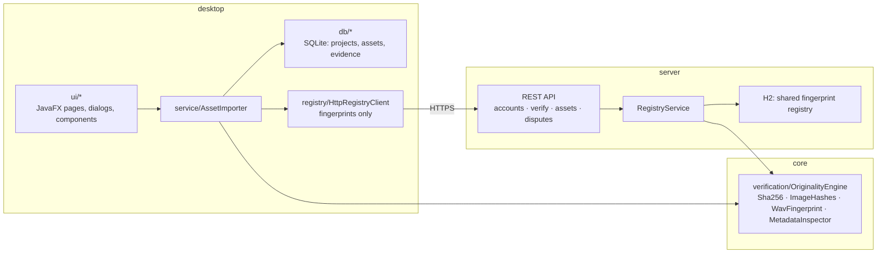

# CreatorFlow

**An asset manager for creative work that checks every file for originality on the way in.**

[](https://github.com/Bryancruzcb/creatorflow/actions/workflows/ci.yml)


CreatorFlow is a JavaFX desktop app for game artists, designers and audio folks: organize sprites,
models and recordings into projects — and every import runs through a **layered verification
pipeline** that fingerprints the file and compares it against everything already in the library.
Byte-identical re-uploads, resized/re-encoded image copies and re-normalized recordings are all
caught and reported with evidence.

It ships in three Maven modules: **`core`** (the verification engine), **`desktop`** (the JavaFX
app), and **`server`** — an optional Spring Boot **shared fingerprint registry** that checks
uploads against *every* account's assets, so the desktop app can verify against the community,
not just your own library. Only fingerprints ever leave your machine, never files.


## The story

This started as a hackathon project — a dashboard mockup for a creator asset platform. The hardest
question we got: *"How would you make sure something being uploaded isn't already someone else's
copyrighted work?"* This rebuild answers it the way real platforms do: **detection layers plus a
declaration workflow**, with honest limits (see [What it can and can't prove](#what-it-can-and-cant-prove)).

## Features

- **Projects & assets** — organize files into projects; imported files are copied into a managed
  library folder and indexed in SQLite
- **Originality check on every import** — four layers, evidence recorded per asset
- **Originality reports** — verdict, per-layer match evidence, provenance findings, and the
  uploader's ownership declaration + license
- **Search & filters** — by name, type, license, project and verification status
- **Drag & drop** — drop files anywhere on the Assets page
- **Demo mode** — procedurally generates a sample library through the real pipeline
- **Community registry (opt-in)** — connect the app to a shared server and every import is also
  checked against everyone else's registered fingerprints; remote matches appear in the report
  as REGISTRY evidence and can escalate the verdict. If the server is down, imports still work.

| Assets | Originality report |
| --- | --- |
|  |  |

## Quickstart

Requires JDK 21+ and Maven.

```bash
git clone https://github.com/Bryancruzcb/creatorflow.git
cd creatorflow
mvn install               # build all modules once
mvn -pl desktop javafx:run
```

Want it pre-populated? Demo mode generates sample sprites, tilesets and recordings — including a
byte-identical copy, an upscaled copy and a re-normalized recording, so each detection layer has
a genuine catch to show:

```bash
mvn -pl desktop javafx:run -Djavafx.options=-Dcreatorflow.demo=true
```

Run the whole test suite (32 tests: engine, persistence, importer, registry API — headless-safe):

```bash
mvn verify
```

Desktop data lives in `~/.creatorflow` (override with `-Dcreatorflow.data.dir=<path>`).

## How the originality check works

Every import runs the applicable layers and compares fingerprints against the indexed library:

| Layer | Catches | How |
| --- | --- | --- |
| **SHA-256** | byte-identical re-uploads of any file type | streaming content hash |
| **dHash + pHash** | resized, re-encoded or lightly edited image copies | 64-bit perceptual fingerprints (gradient hash + 32×32 DCT hash), compared by Hamming distance |
| **Audio energy fingerprint** | re-uploads of the same PCM recording, at any volume | delta-coded RMS envelope — "dHash for sound", volume-invariant by construction |
| **Metadata inspection** | provenance signals a human should see | EXIF/XMP/PNG-text authorship tags surfaced as findings (informational only — metadata is trivially edited) |

The verdict is the worst evidence found — any exact hash match ⇒ **Duplicate**, any fingerprint
within Hamming distance 10/64 ⇒ **Similar**, otherwise **Clear** — and the full evidence trail is
stored with the asset.

### What it can and can't prove

Detection can **prove a conflict** (this file matches that one). It can **never prove
originality** — there is no database of all copyrighted work, because copyright exists the moment
a work is created, registered or not. Real platforms (YouTube Content ID, stock marketplaces)
therefore pair detection with **process**, which CreatorFlow models too: every import records an
explicit ownership declaration and a license choice, so there is an audit trail when a dispute
arrives.

And no — an IP *address* can't tell you who owns a file. Intellectual-property checks are about
content fingerprints and provenance; IP addresses only ever matter server-side as abuse signals
(rate limiting, repeat-infringer heuristics per *account*).

## Platform mode — the shared registry

The desktop app alone can only catch *you* re-importing your own files. The registry server makes
verification communal: accounts register their assets' fingerprints, and every upload is checked
against **all of them** — computed by the exact same `creatorflow-core` engine the desktop runs.

```bash
mvn -pl server spring-boot:run    # starts on http://localhost:8080
```

Then in the desktop app: **Settings → Community registry** → enter the URL → **Create account**
→ **Save**. From then on, every import also shows REGISTRY evidence in its originality report —
including whose asset it matched.

| Endpoint | Auth | Does |
| --- | --- | --- |
| `POST /api/v1/accounts` | — | register a username, receive your API key |
| `GET /api/v1/health` | — | liveness probe |
| `POST /api/v1/verify` | `X-Api-Key` | fingerprints in → verdict + cross-account matches out |
| `POST /api/v1/assets` | `X-Api-Key` | register fingerprints + ownership declaration + license |
| `GET /api/v1/assets/mine` | `X-Api-Key` | your registered assets |
| `POST /api/v1/disputes` | `X-Api-Key` | file an ownership claim against someone's asset |
| `GET /api/v1/disputes/mine` | `X-Api-Key` | disputes you filed and disputes against your assets |

Privacy by construction: clients send SHA-256 + perceptual fingerprints (a few hundred bytes),
never the file. Storage is H2 (`~/.creatorflow-server`); auth is per-account API keys — the
documented production path is JWT/OAuth with rotating credentials.

## Architecture



`core` has no UI, database or Spring dependencies — the desktop app and the server share it as a
plain library, so a fingerprint means exactly the same thing on both sides.

## Roadmap

- [Chromaprint](https://acoustid.org/chromaprint) spectral audio fingerprints
- CLIP-style image embeddings with an ANN index, to catch "same character, redrawn"
  (registry matching is currently a linear scan — fine at this scale, BK-tree/ANN is the next step)
- [C2PA Content Credentials](https://c2pa.org/) verification for provenance-signed files
- Pluggable reverse-image-search connector (e.g. Google Vision web detection) for public-web checks
- JWT/OAuth accounts, takedown resolution workflow for disputes, hosted deployment

## Development

Regenerate the README screenshots (opens a window briefly, uses a throwaway library):

```bash
mvn -q -pl desktop dependency:build-classpath -Dmdep.outputFile=target/cp.txt
java -cp "desktop/target/classes;$(cat desktop/target/cp.txt)" \
     -Dcreatorflow.data.dir=$TEMP/creatorflow-shots \
     -Dcreatorflow.screenshot.dir=docs/screenshots \
     creatorflow.Main
```

## License

[MIT](LICENSE) — © 2026 Bryan Cruz
