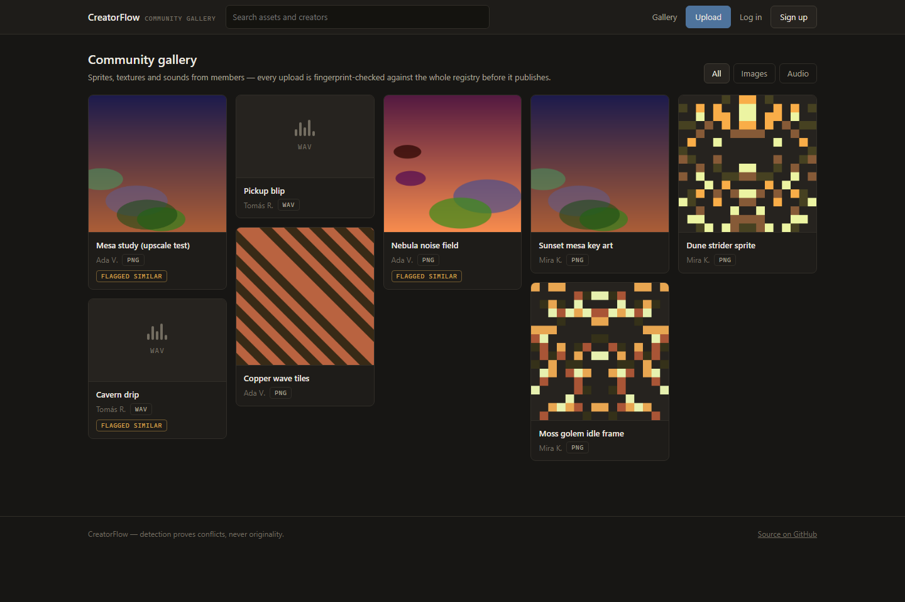
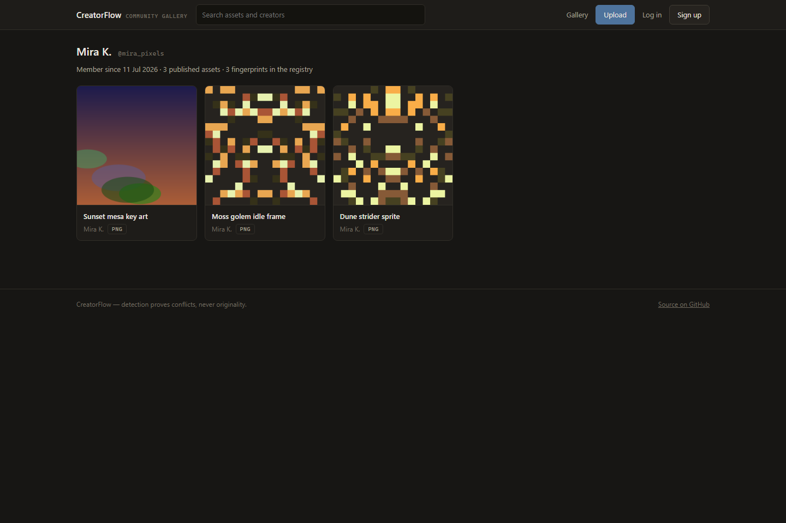
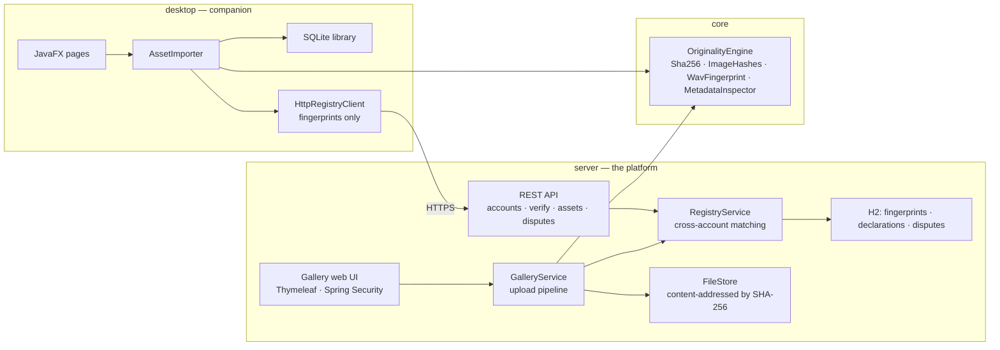

# CreatorFlow

**A community gallery for creative assets — where every upload is originality-checked against the
whole registry before it publishes.**

[](https://github.com/Bryancruzcb/creatorflow/actions/workflows/ci.yml)


Think of the shape of 21st.dev, Cosmos or Pinterest — browse, preview and download sprites,
textures and sounds that members publish — except here the platform itself runs a **layered
fingerprint pipeline** on every upload: exact hashing, perceptual image hashes, a volume-invariant
audio fingerprint and metadata inspection, matched against **every asset ever registered by any
member**. Byte-identical re-uploads never publish. Perceptually similar uploads publish visibly
flagged, with the evidence attached. Every asset carries its license, its uploader's ownership
declaration, and its originality report — and anyone can file a dispute.



Three Maven modules share one engine:

| Module | What it is | Stack |
| --- | --- | --- |
| `core` | The verification engine and domain model | plain Java — no UI, DB or Spring deps |
| `server` | **The platform**: gallery, accounts, uploads, registry API, disputes | Spring Boot 3.3, Thymeleaf, JPA/H2, Spring Security |
| `desktop` | Companion app: local library, projects, offline checks, registry sync | JavaFX 21, SQLite |

## The story

This started as an April 2026 hackathon project (SJ Hacks) — a dashboard mockup for a creator
asset platform. The hardest judge question: *"How would you make sure something being uploaded
isn't already someone else's copyrighted work?"* This rebuild answers it the way real platforms
do — **detection layers plus a declaration-and-dispute process**, with honest limits
(see [What it can and can't prove](#what-it-can-and-cant-prove)) — and then puts that answer at
the front door of an actual community gallery.

## Quickstart

Requires JDK 21+ and Maven.

```bash
git clone https://github.com/Bryancruzcb/creatorflow.git
cd creatorflow
mvn install                                # build everything once (41 tests)
java -jar server/target/creatorflow-server-1.2.0.jar --creatorflow.demo-seed=true
```

Open **http://localhost:8080** — the demo seed publishes three members and eight generated
assets through the real pipeline, including one deliberately re-uploaded image so a
**flagged-similar** asset (and its evidence) is visible immediately. Demo accounts
(`mira_pixels`, `ada_shaders`, `tomas_sound`) share the password `creatorflow-demo`, or sign up
fresh and upload something yourself. Drop the flag for an empty registry;
`mvn -pl server spring-boot:run` works too.

## The platform

- **Gallery** — masonry browse with search and image/audio filters; flagged assets are labeled
  right on the card
- **Upload flow** — pick a file, declare ownership, choose a license, and the pipeline decides:
  **duplicate ⇒ never publishes** (you're pointed at the existing asset and the dispute process),
  **similar ⇒ publishes flagged** with per-layer evidence, **clear ⇒ publishes** with the report
  recorded
- **Asset pages** — preview (image or audio player), license and declaration, SHA-256, the full
  originality report at upload time, download, and an ownership-dispute form
- **Profiles & library** — every member has a public page; `/me` shows your uploads, disputes in
  both directions, and the API key that connects the desktop app
- **One account, two doors** — browsers use session login (BCrypt + CSRF via Spring Security);
  the desktop app and API clients use per-account `X-Api-Key` headers
- **Content-addressed storage** — files are stored by their SHA-256, so identical bytes exist
  once and the hash doubles as a perfect ETag

| Flagged asset with evidence | Member profile |
| --- | --- |
|  |  |

A note on SVG: user-supplied SVG can embed script, so files are served with a no-script
`Content-Security-Policy` and only ever embedded through ``, which never executes it.

## How the originality check works

Every upload (web) and import (desktop) runs the applicable layers and compares fingerprints
against everything already registered:

| Layer | Catches | How |
| --- | --- | --- |
| **SHA-256** | byte-identical re-uploads of any file type | streaming content hash |
| **dHash + pHash** | resized, re-encoded or lightly edited image copies | 64-bit perceptual fingerprints (gradient hash + 32×32 DCT hash), compared by Hamming distance |
| **Audio energy fingerprint** | re-uploads of the same PCM recording, at any volume | delta-coded RMS envelope — "dHash for sound", volume-invariant by construction |
| **Metadata inspection** | provenance signals a human should see | EXIF/XMP/PNG-text authorship tags surfaced as findings (informational only — metadata is trivially edited) |

The verdict is the worst evidence found — any exact hash match ⇒ **Duplicate**, any fingerprint
within Hamming distance 10/64 ⇒ **Similar**, otherwise **Clear** — and the full evidence trail is
stored with the asset.

### What it can and can't prove

Detection can **prove a conflict** (this file matches that one). It can **never prove
originality** — there is no database of all copyrighted work, because copyright exists the moment
a work is created, registered or not. Real platforms (YouTube Content ID, stock marketplaces)
therefore pair detection with **process**, which CreatorFlow implements end to end: ownership
declarations and licenses recorded at upload, verdicts and evidence kept with the asset, and a
dispute workflow for claims.

And no — an IP *address* can't tell you who owns a file. Intellectual-property checks are about
content fingerprints and provenance; IP addresses only ever matter server-side as abuse signals
(rate limiting, repeat-infringer heuristics per *account*).

## The desktop companion

The JavaFX app manages a local library offline: projects, drag-and-drop imports, the same
originality check against your own collection, SQLite persistence.

```bash
mvn -pl desktop javafx:run                # add -Djavafx.options=-Dcreatorflow.demo=true for sample data
```

Connect it to the platform under **Settings → Community registry** (create an account there or
paste the API key from `/me`). Then every local import is also checked against the community —
matches appear as REGISTRY evidence and can escalate the verdict; if the server is down, imports
still work. Desktop clients send **fingerprints only** (a few hundred bytes), never files.
Publishing to the gallery stores the file — that's the point of a gallery — and if you upload a
file whose fingerprints you had already registered from the desktop, the registration is upgraded
in place rather than duplicated.


## API

| Endpoint | Auth | Does |
| --- | --- | --- |
| `POST /api/v1/accounts` | — | register a username, receive your API key |
| `GET /api/v1/health` | — | liveness probe |
| `POST /api/v1/verify` | `X-Api-Key` | fingerprints in → verdict + cross-account matches out |
| `POST /api/v1/assets` | `X-Api-Key` | register fingerprints + ownership declaration + license |
| `GET /api/v1/assets/mine` | `X-Api-Key` | your registered assets |
| `POST /api/v1/disputes` | `X-Api-Key` | file an ownership claim against someone's asset |
| `GET /api/v1/disputes/mine` | `X-Api-Key` | disputes you filed and disputes against your assets |

Server data lives in `~/.creatorflow-server` (H2 database + content-addressed files). Auth is
per-account API keys for clients and session login for browsers; the documented production path
is JWT/OAuth with rotating credentials.

## Architecture



`core` has no UI, database or Spring dependencies — the platform and the desktop app share it as
a plain library, so a fingerprint means exactly the same thing on both sides. 41 tests across the
three modules (`mvn verify`): engine algorithms, persistence, importer + registry escalation, the
REST API, and the full web flow (signup → upload → duplicate blocked → similar flagged → files
served hardened).

## Roadmap

- [Chromaprint](https://acoustid.org/chromaprint) spectral audio fingerprints
- CLIP-style image embeddings with an ANN index, to catch "same character, redrawn"
  (registry matching is currently a linear scan — fine at this scale, BK-tree/ANN is the next step)
- [C2PA Content Credentials](https://c2pa.org/) verification for provenance-signed files
- Collections/boards, tags, and following — the curation half of a gallery
- Pluggable reverse-image-search connector (e.g. Google Vision web detection) for public-web checks
- JWT/OAuth accounts, takedown resolution workflow for disputes, hosted deployment

## Development

Regenerate the web screenshots (server running with the demo seed):

```bash
chrome --headless=new --window-size=1440,960 --hide-scrollbars \
       --screenshot=docs/screenshots/web-gallery.png http://localhost:8080/
```

Desktop screenshots: run `creatorflow.Main` with `-Dcreatorflow.screenshot.dir=docs/screenshots`
and a throwaway `-Dcreatorflow.data.dir`.

## License

[MIT](LICENSE) — © 2026 Bryan Cruz
