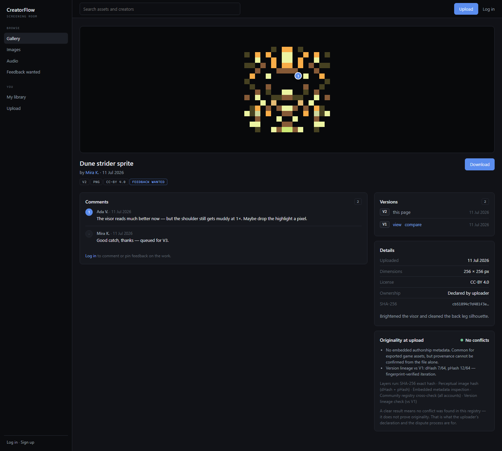
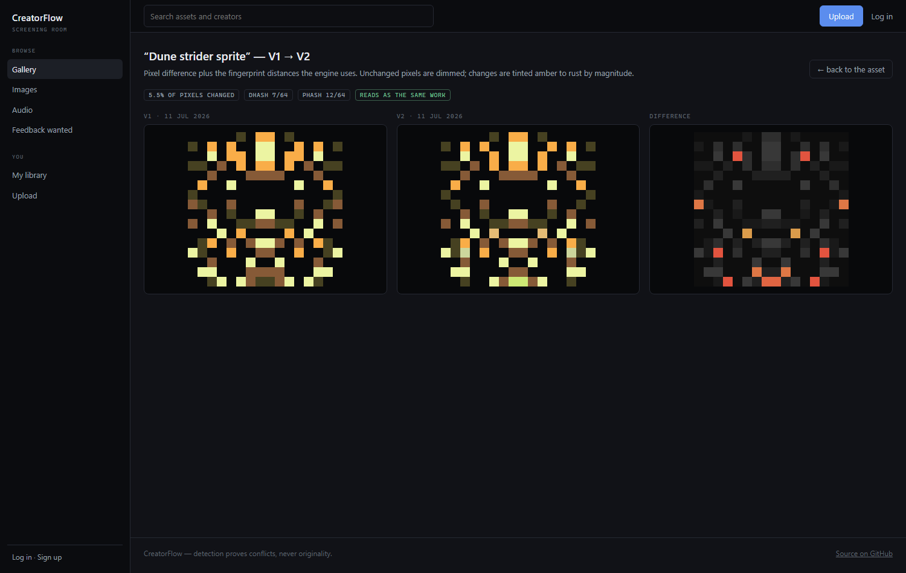
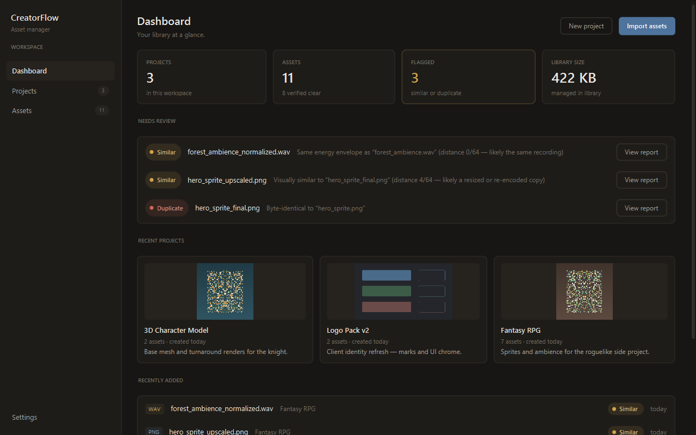
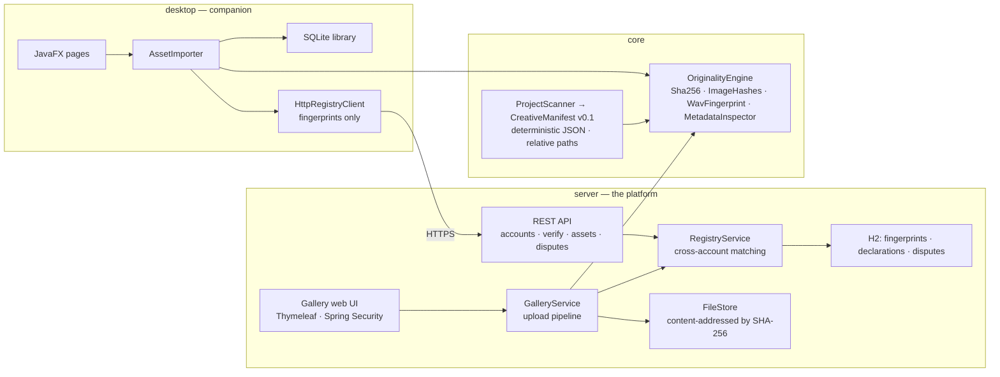

# CreatorFlow

Before a Roblox team publishes an update, CreatorFlow checks every changed asset against a
snapshot of the last release and returns **PASS** or **BLOCKED**.

[](https://github.com/Bryancruzcb/creatorflow/actions/workflows/ci.yml)


It runs locally. A hardened `127.0.0.1` desktop bridge pairs with a Roblox Studio plugin and reads
only normalized KeyframeSequence data — never raw asset files — so nothing leaves your machine.
Changed assets are compared against insert-only SQLite snapshots, provenance findings are resolved
with a required reason, and the run emits a deterministic release manifest naming exactly which
version to roll back to. Similarity and motion comparison are **supporting evidence only, never a
copied/not-copied verdict.**

## The hardest problem: making the comparison engine safe to improve

The accurate motion engine was Java, reachable only through the localhost desktop bridge, and the
website ran a separate, algorithmically different TypeScript engine. Java cannot run in a browser
at all — and serving it would have meant a paid JVM tier, a lossy converter, and a network round
trip purely to run code that can't run where the users are. So I reimplemented the Java algorithm
in TypeScript and **proved numeric parity against a Java-generated oracle before touching any of
the math** (rounded fields within 0.01, intermediates around 1e-6). Committing that port before
changing anything is the whole reason the later numbers mean something: every improvement after it
was measured against a provably identical baseline.

Swapping the old browser engine for that port is what moved the headline number:

| | before | after |
| --- | --- | --- |
| False positives | 14/97 (14.4%) | **4/97 (4.1%)** |
| Recall | 112/119 (94.1%) | 110/119 (92.4%) |

The 1.7-point recall cost is two mirror cases, and it was a deliberate trade. Three tuning changes
went in on top — multiplicative-coverage composition, a position de-weight, and banded DTW — each
graded separately against the same scorecard; net they bought recall back at no false-positive
cost. The engine is pinned by 23 golden vectors and a parity test that fails if the port drifts
from the Java reference.

<!-- SCREENSHOT — replace this comment before treating the README as done.
     Capture one frame of the preflight workspace showing a real BLOCKED release record: the
     verdict, the findings that caused it, and the named rollback target, all visible together.
     A real run, not a mockup. Save as docs/screenshots/preflight-blocked.png, then:


-->

## How it's put together

| Module | What it is | Stack |
| --- | --- | --- |
| `core` | Verification/motion engine, project scanner, versioned manifest model, release-gate CLI | plain Java — no UI, DB or Spring deps |
| `desktop` | **The preflight app**: local loopback bridge, SQLite store, plugin pairing, project picker | JavaFX 21, SQLite |
| `frontend` | The release-preflight workspace UI (motion lab, snapshots, evidence, releases) | React 19 + Vite + TypeScript |
| `server` | **Frozen legacy**: community gallery, accounts, uploads, registry API, disputes | Spring Boot 3.3, Thymeleaf, JPA/H2 |

`core` has no UI, database, or Spring dependencies, so a fingerprint means exactly the same thing
in the CLI as it does in the desktop app.

## Quickstart

Requires JDK 21+ and Maven.

```bash
git clone https://github.com/Bryancruzcb/creatorflow.git
cd creatorflow
mvn install          # builds everything and runs the full Java test suite
```

To run the preflight desktop app:

```bash
mvn -pl desktop javafx:run
```

Pair it with the Roblox Studio plugin in [`roblox-plugin/`](roblox-plugin), pick a project, and
export a release to see a PASS/BLOCKED record. The frozen community gallery still builds and runs
separately — see [Legacy: the community gallery](#legacy-the-community-gallery).

## Project history

This began as an April 2026 hackathon project (SJ Hacks) whose hardest judge question was *"How
would you make sure something being uploaded isn't already someone else's copyrighted work?"* The
answer — detection layers plus a declaration-and-dispute process, with honest limits — became a
community gallery. On 2026-07-17 I narrowed it to the one workflow with a real, unserved user:
release preflight for small Roblox teams, where the same honesty constraint (similarity is a
review lead, never a verdict) is exactly right.

Full detail in [`docs/STRATEGIC-REDIRECT.md`](docs/STRATEGIC-REDIRECT.md) and the
[consolidation report](docs/CONSOLIDATION-REPORT.md) that mapped the decision against the code.

## Legacy: the community gallery

> **Frozen (2026-07-17).** Everything from here down describes the pre-redirect community-gallery
> product. The code is real, tested, and still builds (`server/` + the desktop "Community registry"
> settings card), but it is **not** the current product and receives no new work. It is kept green
> as a candidate to later repurpose as a shared cross-team provenance registry. The release-preflight
> workflow described at the top of this file does not use the Spring server at all.

- **Gallery** — a dark, media-first grid ("screening room") with search, image/audio filters and
  a *feedback wanted* view; version badges and flags are labeled right on the tile
- **Upload flow** — pick a file, declare ownership, choose a license, and the pipeline decides:
  **duplicate ⇒ never publishes** (you're pointed at the existing asset and the dispute process),
  **similar ⇒ publishes flagged** with per-layer evidence, **clear ⇒ publishes** with the report
  recorded
- **Version stacks** — publish V2 from the asset page and the engine verifies the lineage:
  similarity *inside* your stack is recorded as iteration ("dHash 7/64 — fingerprint-verified
  iteration"), never flagged; similarity to anything *outside* it keeps its consequences, and a
  byte-identical repeat of any version is refused. The gallery shows only the latest version.
- **Visual diff** — compare any two image versions: a pixel-difference heatmap (changes tinted
  amber→rust by magnitude) plus %-changed and the fingerprint distances
- **Pinned comments** — click a point on the artwork and your comment carries a numbered pin,
  frame.io-style; owners can toggle *feedback wanted* to invite review
- **Asset pages** — near-black stage, versions rail, details, the full originality report at
  upload time, download, and an ownership-dispute form
- **Profiles & library** — every member has a public page; `/me` shows your uploads, disputes in
  both directions, and the API key that connects the desktop app
- **One account, two doors** — browsers use session login (BCrypt + CSRF via Spring Security);
  the desktop app and API clients use per-account `X-Api-Key` headers
- **Content-addressed storage** — files are stored by their SHA-256, so identical bytes exist
  once and the hash doubles as a perfect ETag (diff heatmaps are deterministic, so a SHA pair
  makes a strong ETag there too)

| Version stack with a pinned review comment | Visual diff between versions |
| --- | --- |
|  |  |

A note on SVG: user-supplied SVG can embed script, so files are served with a no-script
`Content-Security-Policy` and only ever embedded through ``, which never executes it.

## How the originality check works

Every upload (web) and import (desktop) runs the applicable layers and compares fingerprints
against everything already registered:

| Layer | Catches | How |
| --- | --- | --- |
| **SHA-256** | byte-identical re-uploads of any file type | streaming content hash |
| **dHash + pHash** | resized, re-encoded or lightly edited image copies | 64-bit perceptual fingerprints (gradient hash + 32×32 DCT hash), compared by Hamming distance |
| **Audio energy fingerprint** | re-uploads of the same PCM recording, at any volume | delta-coded RMS envelope — "dHash for sound", volume-invariant by construction |
| **Metadata inspection** | provenance signals a human should see | EXIF/XMP/PNG-text authorship tags surfaced as findings (informational only — metadata is trivially edited) |

The verdict is the worst evidence found — any exact hash match ⇒ **Duplicate**, any fingerprint
within Hamming distance 10/64 ⇒ **Similar**, otherwise **Clear** — and the full evidence trail is
stored with the asset.

### What it can and can't prove

Detection can **prove a conflict** (this file matches that one). It can **never prove
originality** — there is no database of all copyrighted work, because copyright exists the moment
a work is created, registered or not. Real platforms (YouTube Content ID, stock marketplaces)
therefore pair detection with **process**, which CreatorFlow implements end to end: ownership
declarations and licenses recorded at upload, verdicts and evidence kept with the asset, and a
dispute workflow for claims.

And no — an IP *address* can't tell you who owns a file. Intellectual-property checks are about
content fingerprints and provenance; IP addresses only ever matter server-side as abuse signals
(rate limiting, repeat-infringer heuristics per *account*).

## The desktop companion

The JavaFX app manages a local library offline: projects, drag-and-drop imports, the same
originality check against your own collection, SQLite persistence.

```bash
mvn -pl desktop javafx:run                # add -Djavafx.options=-Dcreatorflow.demo=true for sample data
```

Connect it to the platform under **Settings → Community registry** (create an account there or
paste the API key from `/me`). Then every local import is also checked against the community —
matches appear as REGISTRY evidence and can escalate the verdict; if the server is down, imports
still work. Desktop clients send **fingerprints only** (a few hundred bytes), never files.
Publishing to the gallery stores the file — that's the point of a gallery — and if you upload a
file whose fingerprints you had already registered from the desktop, the registration is upgraded
in place rather than duplicated.

## The Roblox Studio plugin

`roblox-plugin/` is a Studio plugin (Luau + [Rojo](https://rojo.space)) that brings the registry to
Roblox animation teams: select a `KeyframeSequence`, and the plugin canonicalizes it, fingerprints
it with pure-Luau SHA-256, and checks it against the community registry through the same
`/api/v1/verify` + `X-Api-Key` contract the desktop app uses — **the animation itself never
leaves Studio**. Clean versions can be registered from the panel, and Studio's per-plugin HTTP
permissions mean nothing changes in the game's own settings.

```bash
rojo build roblox-plugin --plugin CreatorFlow.rbxm   # installs into Studio's plugins folder
```

See [`roblox-plugin/README.md`](roblox-plugin/README.md) for setup and the roadmap
(team registries, Roblox animation-ID lifecycle tracking, version stacks from Studio).

## Release-manifest milestone

`creatorflow-core` now has the first production slice of the release-preflight direction:

- `ProjectScanner` recursively inventories supported creative files using project-relative paths.
- Every file runs through the existing SHA-256, image, audio, and metadata layers.
- Relationships inside the project—exact duplicates, perceptually similar images, and related audio—are retained in the inventory.
- `CreativeManifest` defines the versioned `creatorflow.manifest/v0.1` contract.
- `ManifestJson` writes deterministic JSON and re-imports it.
- The JSON Schema ships inside the core JAR as `creatorflow-manifest-v0.1.schema.json`.
- Source/license resolution is an explicit interface; an absent record remains unresolved instead of being mistaken for a clean ownership result.

Run the current CLI bridge against a real project directory:

```bash
mvn -q -pl core org.codehaus.mojo:exec-maven-plugin:3.3.0:java \
  -Dexec.mainClass=creatorflow.manifest.ManifestCli \
  -Dexec.args='/path/to/project MyProject 0.1.0 /path/to/manifest.json'
```

Append `--exclude <directory-name>` (repeatable) to keep fixture or vendor trees out of the scan
on top of the built-in exclusions — e.g. this repository's own dogfood scan needs
`--exclude stress-fixtures`, whose deliberately duplicated test textures would otherwise
hard-block the release gate.

The hardened scanner also exposes configurable exclusions, ordered progress events, cancellation with a usable partial manifest, per-file failure isolation, dependency findings, and symlink containment. The desktop module now owns a loopback-only local bridge and migrated workflow store for project selection, immutable scan runs, source evidence, append-only decisions, releases, and workspace restoration.

To run the desktop-owned browser workspace directly from a frontend build:

```bash
npm --prefix frontend run build
mvn -pl desktop javafx:run \
  -Djavafx.options="-Dcreatorflow.web.root=$(pwd)/frontend/dist -Dcreatorflow.web.open=true"
```

For a self-contained desktop artifact, activate the packaging profile by supplying the same build
directory at package time:

```bash
mvn -pl desktop -am package \
  -Dcreatorflow.web.dist=$(pwd)/frontend/dist
```

Large demonstration GLBs are intentionally optional: serving an external `dist` keeps ordinary
desktop builds lean, while the packaged profile is available for an offline showcase build.

### Roblox animation bridge prototype

CreatorFlow now has a loopback-only Roblox Studio input for animation evidence. The Studio plugin
reads two animation IDs that the signed-in creator is permitted to access, flattens each
`KeyframeSequence` into stable joint paths and local `CFrame` values, and sends one bounded JSON
request to the desktop app. The Java core recanonicalizes that data, computes deterministic
SHA-256 curve fingerprints, compares pose/timing/joint coverage, and stores the result with the
selected local project. Raw joint curves are not retained in SQLite.

Friend-test flow:

1. Build the React workspace and run the desktop-owned browser workspace with the commands above.
2. Open a local project, choose **Animation compare**, and create a temporary Studio pairing.
3. Install [`roblox-plugin/desktop-bridge/CreatorFlowAnimationBridge.lua`](roblox-plugin/desktop-bridge/CreatorFlowAnimationBridge.lua)
   using the source-first instructions in the [desktop-bridge guide](roblox-plugin/desktop-bridge/README.md).
4. Paste the displayed loopback endpoint and token into Studio, test the connection, then compare
   two permitted animation IDs. The evidence inbox refreshes automatically.

The first slice supports `KeyframeSequence` assets. `CurveAnimation`, inaccessible/private assets,
rig retargeting, and copyright conclusions are explicitly outside v0.1. Roblox Studio decides
whether an animation can be read; CreatorFlow does not bypass asset permissions.

Run the default release policy against a manifest with machine-readable output:

```bash
mvn -q -pl core org.codehaus.mojo:exec-maven-plugin:3.3.0:java \
  -Dexec.mainClass=creatorflow.manifest.ReleaseGateCli \
  -Dexec.args='/path/to/manifest.json --output /path/to/gate-report.json'
```

The command exits `0` when the release passes, `2` when policy blocks it, and `3` for invalid input or execution failure. `.github/workflows/creatorflow-release-gate.yml` shows the CI integration and report upload.



## API

| Endpoint | Auth | Does |
| --- | --- | --- |
| `POST /api/v1/accounts` | — | register a username, receive your API key |
| `GET /api/v1/health` | — | liveness probe |
| `POST /api/v1/verify` | `X-Api-Key` | fingerprints in → verdict + cross-account matches out |
| `POST /api/v1/assets` | `X-Api-Key` | register fingerprints + ownership declaration + license |
| `GET /api/v1/assets/mine` | `X-Api-Key` | your registered assets |
| `POST /api/v1/assets/{id}/mappings` | `X-Api-Key` | record the Roblox id an asset was uploaded as in one ownership context (upsert per context) |
| `GET /api/v1/assets/{id}/mappings` | `X-Api-Key` | the asset's Roblox ids per context, e.g. `group:12345 → 222` |
| `POST /api/v1/disputes` | `X-Api-Key` | file an ownership claim against someone's asset |
| `GET /api/v1/disputes/mine` | `X-Api-Key` | disputes you filed and disputes against your assets |

Server data lives in `~/.creatorflow-server` (H2 database + content-addressed files). Auth is
per-account API keys for clients and session login for browsers; the documented production path
is JWT/OAuth with rotating credentials.

## Architecture



`core` has no UI, database or Spring dependencies — the platform and the desktop app share it as
a plain library, so a fingerprint means exactly the same thing on both sides. The Java test suites
across the three modules (`mvn verify`) cover: engine algorithms, persistence, importer + registry escalation, the
REST API, the full web flow (signup → upload → duplicate blocked → similar flagged → files served
hardened), and the review layer (version lineage vs foreign similarity, stack-only compare,
pinned comments, feedback filtering).

## Roadmap

- Add project-wide source aggregation, server-side evidence search, and saved filter views
- Add incremental scan caching and resumable work after process termination
- Sign exported release artifacts and verify signatures in the CI gate
- [Chromaprint](https://acoustid.org/chromaprint) spectral audio fingerprints
- CLIP-style image embeddings with an ANN index, to catch "same character, redrawn"
  (registry matching is currently a linear scan — fine at this scale, BK-tree/ANN is the next step)
- [C2PA Content Credentials](https://c2pa.org/) verification for provenance-signed files
- Collections/boards, tags, and following — the curation half of a gallery
- Audio waveform rendering and time-anchored comments (the pin, but for sound)
- Pluggable reverse-image-search connector (e.g. Google Vision web detection) for public-web checks
- JWT/OAuth accounts, takedown resolution workflow for disputes, hosted deployment

## Development

Regenerate the web screenshots (server running with the demo seed):

```bash
chrome --headless=new --window-size=1440,960 --hide-scrollbars \
       --screenshot=docs/screenshots/web-gallery.png http://localhost:8080/
```

Desktop screenshots: run `creatorflow.Main` with `-Dcreatorflow.screenshot.dir=docs/screenshots`
and a throwaway `-Dcreatorflow.data.dir`.

## License

[MIT](LICENSE) — © 2026 Bryan Cruz
