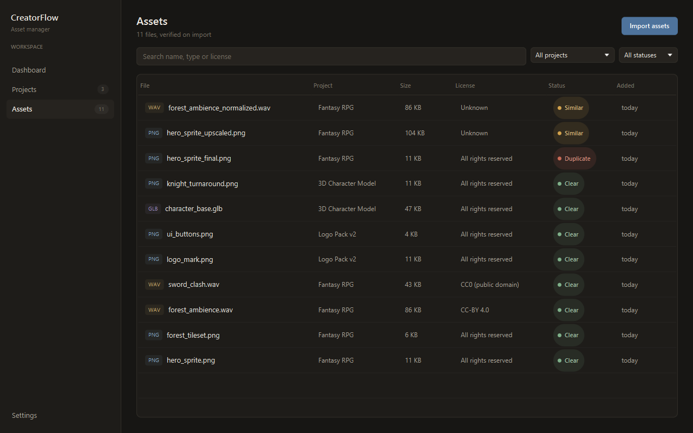
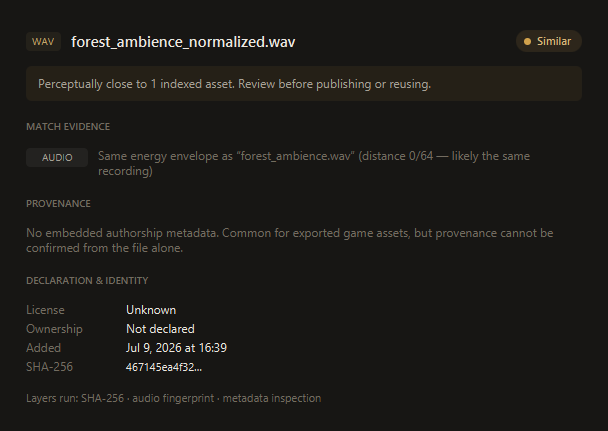
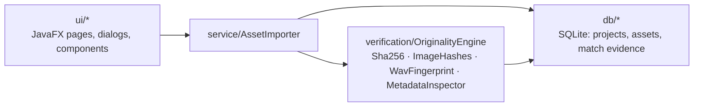

# CreatorFlow

**An asset manager for creative work that checks every file for originality on the way in.**

[](https://github.com/Bryancruzcb/creatorflow/actions/workflows/ci.yml)


CreatorFlow is a JavaFX desktop app for game artists, designers and audio folks: organize sprites,
models and recordings into projects — and every import runs through a **layered verification
pipeline** that fingerprints the file and compares it against everything already in the library.
Byte-identical re-uploads, resized/re-encoded image copies and re-normalized recordings are all
caught and reported with evidence.


## The story

This started as a hackathon project — a dashboard mockup for a creator asset platform. The hardest
question we got: *"How would you make sure something being uploaded isn't already someone else's
copyrighted work?"* This rebuild answers it the way real platforms do: **detection layers plus a
declaration workflow**, with honest limits (see [What it can and can't prove](#what-it-can-and-cant-prove)).

## Features

- **Projects & assets** — organize files into projects; imported files are copied into a managed
  library folder and indexed in SQLite
- **Originality check on every import** — four layers, evidence recorded per asset
- **Originality reports** — verdict, per-layer match evidence, provenance findings, and the
  uploader's ownership declaration + license
- **Search & filters** — by name, type, license, project and verification status
- **Drag & drop** — drop files anywhere on the Assets page
- **Demo mode** — procedurally generates a sample library through the real pipeline

| Assets | Originality report |
| --- | --- |
|  |  |

## Quickstart

Requires JDK 21+ and Maven.

```bash
git clone https://github.com/Bryancruzcb/creatorflow.git
cd creatorflow
mvn javafx:run
```

Want it pre-populated? Demo mode generates sample sprites, tilesets and recordings — including a
byte-identical copy, an upscaled copy and a re-normalized recording, so each detection layer has
a genuine catch to show:

```bash
mvn javafx:run -Djavafx.options=-Dcreatorflow.demo=true
```

Run the tests (23 unit tests, headless-safe):

```bash
mvn test
```

Data lives in `~/.creatorflow` (override with `-Dcreatorflow.data.dir=<path>`).

## How the originality check works

Every import runs the applicable layers and compares fingerprints against the indexed library:

| Layer | Catches | How |
| --- | --- | --- |
| **SHA-256** | byte-identical re-uploads of any file type | streaming content hash |
| **dHash + pHash** | resized, re-encoded or lightly edited image copies | 64-bit perceptual fingerprints (gradient hash + 32×32 DCT hash), compared by Hamming distance |
| **Audio energy fingerprint** | re-uploads of the same PCM recording, at any volume | delta-coded RMS envelope — "dHash for sound", volume-invariant by construction |
| **Metadata inspection** | provenance signals a human should see | EXIF/XMP/PNG-text authorship tags surfaced as findings (informational only — metadata is trivially edited) |

The verdict is the worst evidence found — any exact hash match ⇒ **Duplicate**, any fingerprint
within Hamming distance 10/64 ⇒ **Similar**, otherwise **Clear** — and the full evidence trail is
stored with the asset.

### What it can and can't prove

Detection can **prove a conflict** (this file matches that one). It can **never prove
originality** — there is no database of all copyrighted work, because copyright exists the moment
a work is created, registered or not. Real platforms (YouTube Content ID, stock marketplaces)
therefore pair detection with **process**, which CreatorFlow models too: every import records an
explicit ownership declaration and a license choice, so there is an audit trail when a dispute
arrives.

And no — an IP *address* can't tell you who owns a file. Intellectual-property checks are about
content fingerprints and provenance; IP addresses only ever matter server-side as abuse signals
(rate limiting, repeat-infringer heuristics per *account*).

## Architecture



The `verification` package has no UI or database dependencies, so it can lift straight into a
server later (see roadmap).

## Roadmap — platform mode

The natural next phase moves verification server-side, so uploads are checked against *every*
user's assets rather than one local library:

- Spring Boot service with a shared fingerprint registry and per-account upload history
- DMCA-style dispute and takedown workflow (detection + process, per above)
- [Chromaprint](https://acoustid.org/chromaprint) spectral audio fingerprints
- CLIP-style image embeddings with an ANN index, to catch "same character, redrawn"
- [C2PA Content Credentials](https://c2pa.org/) verification for provenance-signed files
- Pluggable reverse-image-search connector (e.g. Google Vision web detection) for public-web checks

## Development

Regenerate the README screenshots (opens a window briefly, uses a throwaway library):

```bash
mvn -q dependency:build-classpath -Dmdep.outputFile=target/cp.txt
java -cp "target/classes;$(cat target/cp.txt)" \
     -Dcreatorflow.data.dir=$TEMP/creatorflow-shots \
     -Dcreatorflow.screenshot.dir=docs/screenshots \
     creatorflow.Main
```

## License

[MIT](LICENSE) — © 2026 Bryan Cruz
